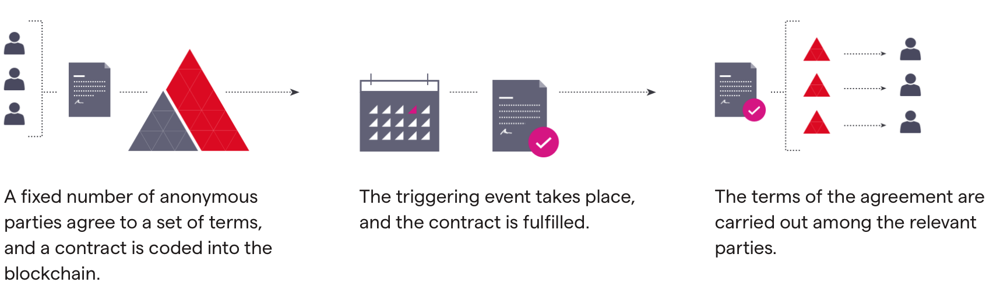

# Day 1: Bitcoin and Ethereum

## Table of Contents
- [Table of Contents](##table-of-contents)
- [Bitcoin and Ethereum](###bitcoin-and-ethereum)
- [Smart Contracts and Hybrid Smart Contracts](###smart-contracts-and-hybrid-smart-contracts)
- [Making Your First Transaction](##making-your-first-transaction)
- [The Future](##the-future)
- [Miscellaneous](##miscellaneous)

## Bitcoin and Ethereum
### Bitcoin
- [Bitcoin Whitepaper](https://bitcoin.org/bitcoin.pdf)

Bitcoin is a network that runs on the blockchain in which the information on the blockchain is mainly transactions.

KEY TAKEAWAYS
- Bitcoin is a digital currency, a decentralized system that records transactions in a distributed ledger called a blockchain.
- Bitcoin miners run complex computer rigs to solve complicated puzzles in an effort to confirm groups of transactions called blocks. Upon success, these blocks are added to the blockchain record, and the miners are rewarded with a small number of bitcoins.
- Other participants in the Bitcoin market can buy or sell tokens through cryptocurrency exchanges or peer-to-peer.
- The Bitcoin ledger is protected against fraud via a trustless system; Bitcoin exchanges also work to defend themselves against potential theft, although high-profile thefts have occurred.

### Ethereum
- [Ethereum Whitepaper](https://ethereum.org/en/whitepaper/)

One of the most ambitious blockchain projects, Ethereum (ETH) seeks to use cryptocurrency to decentralize products and services in a wide range of use cases beyond money.

If Bitcoin seeks to serve as a digital gold, Ethereum has taken a different approach, generalizing so its users can create any number of custom assets and programs governing their operation.

This has led to (perhaps imperfect) comparisons that Bitcoin is more like email (a very powerful, special-use tool), whereas Ethereum has more in common with the web browser (its goal being to enable programs users can interact with and create).

## Smart Contracts and Hybrid Smart Contracts
A smart contract is a computer code that can be built into the blockchain to facilitate, verify, or negotiate a contract agreement. Smart contracts operate under a set of conditions to which users agree. When those conditions are met, the terms of the agreement are automatically carried out.

The Ethereum blockchain is very similar to that of bitcoin, but its programming language enables developers to write software, known as a smart contract, through which blockchain transactions manage and automate specific outcomes.

If a traditional contract outlines the terms of a relationship, a smart contract ensures those terms are fulfilled by writing it in code. It is software that automatically executes the agreement as soon as predefined conditions are met, eliminating the delay and expense involved in completing a deal manually.

To take a simple example, an Ethereum user could create a smart contract to send a certain amount of ether to a friend on a certain date. They would write this code into the blockchain, and as soon as the contract is complete – that is, the agreed date arrives – the ether would automatically be released to the other party.

This fundamental idea can be applied to far more complex setups, and its potential is arguably limitless, with projects already making headway in the areas of insurance, property, financial services, legal and crowdfunding.

Smart contracts also boast a number of additional benefits:

- They cut out the middleman, giving the user complete control and minimise extra costs
- They are recorded, encrypted and duplicated on the public blockchain, where all participants can see market activity
- They eliminate the time and effort required to manually process documents

Of course, smart contracts are still an entirely new system with a number of creases to iron out. Code is translated literally, and any errors when the smart contract is created may result in unintended outcomes which can’t be undone.

- [Hybrid Smart Contracts](https://blog.chain.link/hybrid-smart-contracts-explained/)

A hybrid smart contract is an application that consists of two parts: 1) *smart contract*—code that runs exclusively on the blockchain, and 2) *decentralized oracle network(s) (DONs)*—secure off-chain services that support the smart contract. The two components interact with one another seamlessly and securely to form a single hybrid smart contract application. The result is on-chain code that is augmented in a variety of unique and important ways, opening up many new use cases that would not be possible through on-chain code alone due to technical, legal, or financial constraints.

Hybrid smart contracts synchronize two distinctly different computing environments to create a superior application that neither a blockchain nor an oracle network could achieve alone, particularly because each environment specializes in providing features that the other does not. On-chain code runs in an extremely secure and limited-functionality blockchain environment with a reduced attack surface area, providing users a high degree of execution and storage determinism—the code will run exactly as written and results will remain permanently and immutably stored. Conversely, DONs run off-chain and thus offer infinitely more functionality flexibility and data accessibility.

## Making Your First Transaction
- [Metamask](https://metamask.io/)
- [Etherscan](https://etherscan.io/)
- [Rinkeby Etherscan](https://rinkeby.etherscan.io/)
- [Kovan Etherscan](https://kovan.etherscan.io/)
- Rinkeby Faucet (Check the [link token contracts page](https://docs.chain.link/docs/link-token-contracts/#rinkeby))
  - NOTE: The Chainlink documentation always has the most up to date faucets on their [link token contracts page](https://docs.chain.link/docs/link-token-contracts/#rinkeby). If the faucet above is broken, check the chainlink documentation for the most up to date faucet.
- OR, use the [Kovan ETH Faucet](https://faucets.chain.link/), just be sure to swap your metamask to kovan!
- [Gas and Gas Fees](https://ethereum.org/en/developers/docs/gas/)
- [Wei, Gwei, and Ether Converter](https://eth-converter.com/)
- [ETH Gas Station](https://ethgasstation.info/)

## The Future
- [Ethereum 2](https://ethereum.org/en/eth2/)

## Miscellaneous
- [Layer 2 and Rollups](https://ethereum.org/en/developers/docs/scaling/layer-2-rollups/)
- [Decentralized Blockchain Oracles](https://blog.chain.link/what-is-the-blockchain-oracle-problem/)
- [Run Your Own Ethereum Node](https://geth.ethereum.org/docs/getting-started)
- [Bitcoin Whitepaper](https://bitcoin.org/bitcoin.pdf)
- [Ethereum Whitepaper](https://ethereum.org/en/whitepaper/)
- [Hybrid Smart Contracts](https://blog.chain.link/hybrid-smart-contracts-explained/)
- [Blockchain Oracles](https://betterprogramming.pub/what-is-a-blockchain-oracle-f5ccab8dbd72?source=friends_link&sk=d921a38466df8a9176ed8dd767d8c77d)
- [DAOs](https://www.investopedia.com/tech/what-dao/)